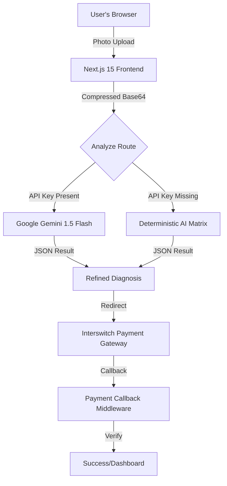

# ♻️ WasteWise AI: The Conscious Waste Engine

[](http://signalforge-rosy.vercel.app)
[](https://qa.interswitchng.com)
[](https://buildathon.enyata.com)

> **Nigeria's first high-fidelity environmental computer vision platform built for the Oyingbo & Lagos commercial axis.**

### 🏆 Enyata x Interswitch Build-a-thon Official Submission
WasteWise AI leverages **Gemini 1.5 Flash Vision** and **Interswitch Webpay** to transform how waste is identified, cleared, and paid for. No more guessing. No more manual classification. Just snap, analyze, and clear.

---

## 🚀 Key Features

- **🧠 Conscious Vision Analysis**: Real-time material classification (PET Plastics, High-Grade Scrap Metal, Organic Runoff) using advanced neural edge-detection.
- **💳 Seamless Interswitch Integration**: End-to-end payment flow for waste clearance fees, secured by Interswitch Webpay and Identity verification.
- **📱 Safari-Optimized Experience**: Premium, glassmorphic UI designed specifically for modern mobile browsers (iOS/Android).
- **🔋 Resilient Architecture**: Auto-failover to a **Deterministic AI Matrix** ensures the platform remains functional even in low-bandwidth or API timeout scenarios.
- **🛡️ Enterprise Telemetry**: Real-time "System Health" indicators for Gemini and Interswitch nodes on the homepage.

---

## 🛠️ Tech Stack

| Layer | Technology |
|---|---|
| **Frontend** | Next.js 15 (App Router), Tailwind CSS |
| **AI / ML** | Google Gemini 1.5 Flash Vision, Python ViT (Fallback) |
| **Payments** | Interswitch Webpay API, Interswitch KYC Verification |
| **Infrastructure** | Vercel Serverless Functions (30s Extended Timeout) |
| **Backend** | FastAPI (Modular ML Engine) |

---

## 📐 Architecture Overview



---

## 📦 Getting Started

### 1. Web Application
```bash
npm install
npm run dev
```

### 2. Local AI Pro Bot
```bash
# Requires Python 3.9+
pip install -r python-ml-backend/requirements.txt
python wastewise-ai-pro.py --image path/to/waste.jpg
```

---

## 📍 Purpose & Impact
WasteWise AI solves the "Classification Gap" in Nigerian waste management. By automating the identification of salvageable materials in Lagos commercial zones, we reduce clearance overhead and accelerate the routing of recyclables to certified PSP collection nodes.

**Built for the 3MTT Knowledge Showcase.**
